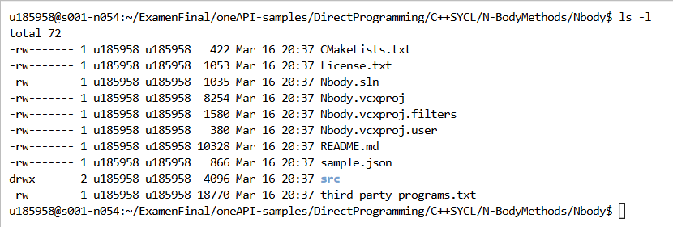
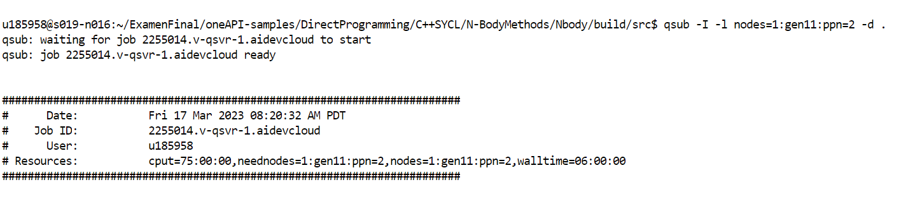
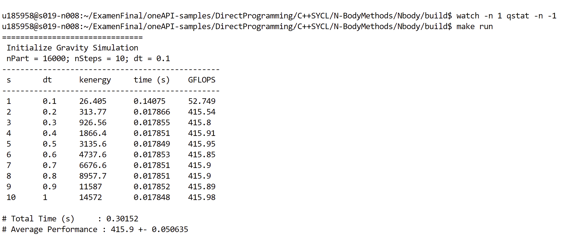
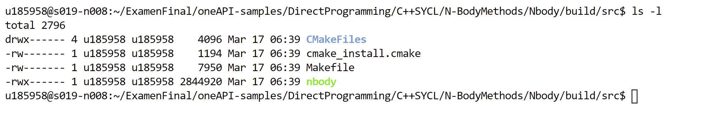
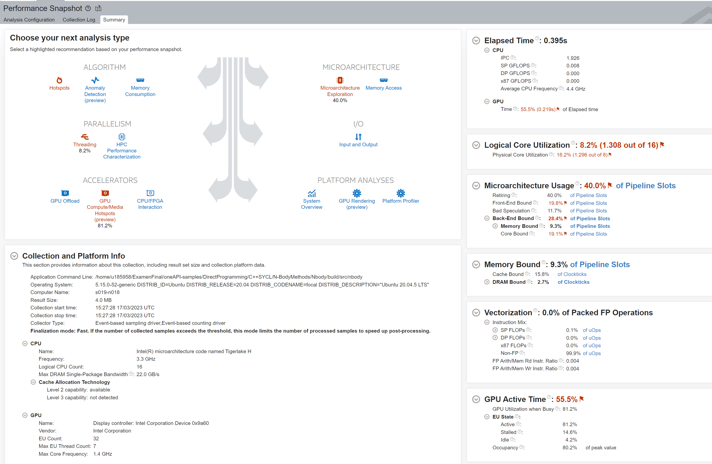
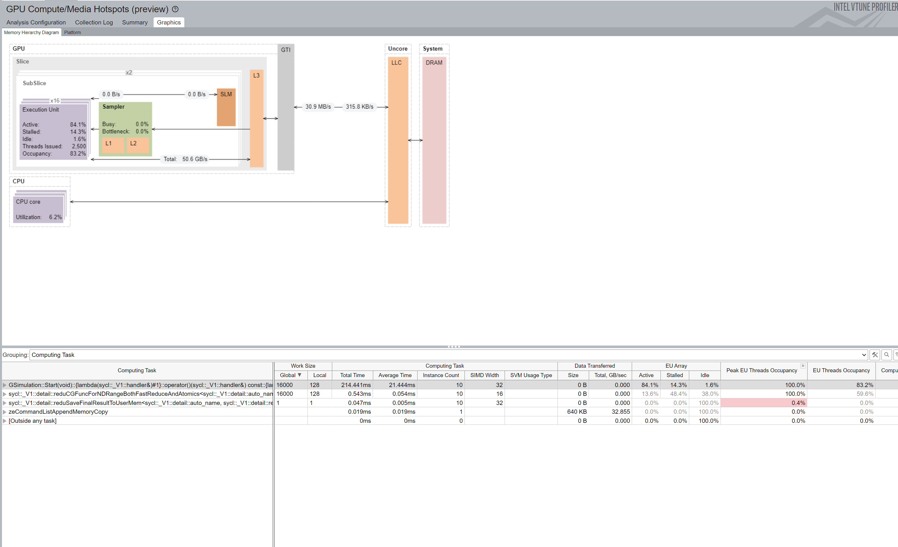
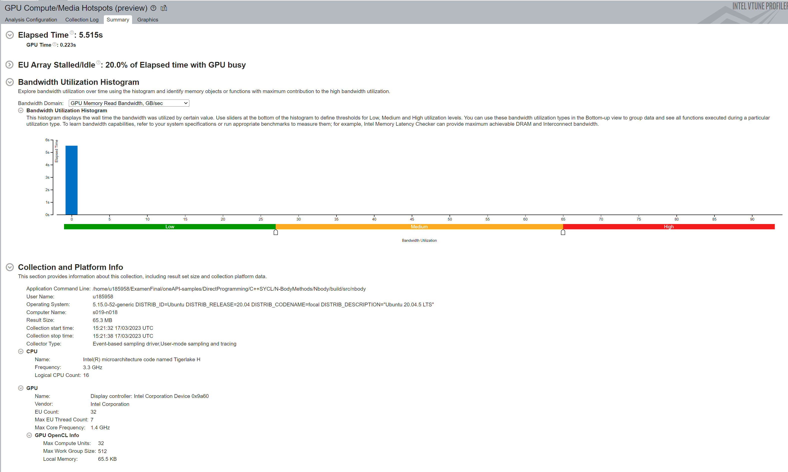
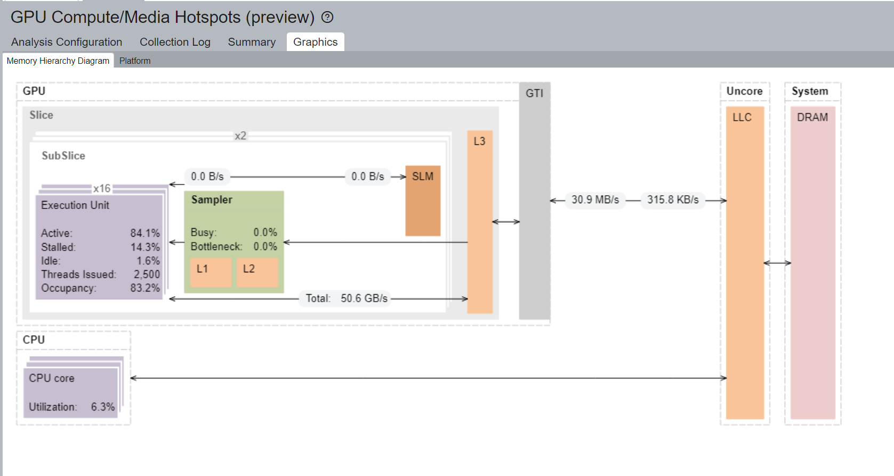
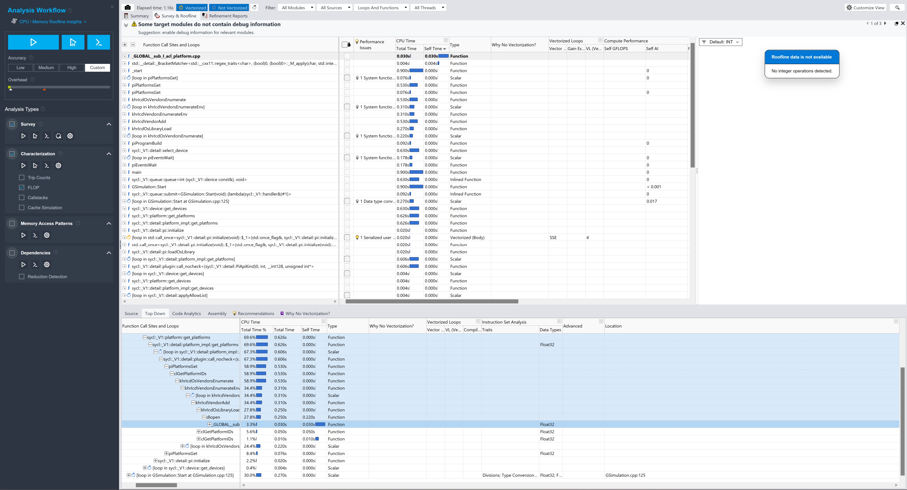

# Respuestas - Iván León Gavino
-----
0. **Se clona el proyecto con el siguiente comando: `git clone https://github.com/oneapi-src/oneAPI-samples`**

1. **Directorio de Nbody: `/home/u185958/ExamenFinal/oneAPI-samples/DirectProgramming/C++SYCL/N-BodyMethods/Nbody`**

2. **Explicar brevemente el algoritmo de `Nbody`:**

    *Algoritmo altamente paralelo a los datos, se puede usar para descargar a las GPU's. Debido que a través de este se puede tratar varios kernels de dispositivos, permite poner en cola SYCL para su ejecución y manejar reducciones paralelas.*

3. **Acceder en modo interactivo a un nodo de cómputo con GPUs.**  Se tomó el control del nodo `gen11`. 
    
    Imagen, dónde se accedió al nodo gen11 del devcloud, a través del comando `qsub -I -l nodes=1:gen11:ppn=2 -d .`
   
    ----
    
    - **Compilar y ejecutar** `Nbody` 
    *Al compilar y ejecutar el nbody se obtiene el resultado tal como se muestra en la imagen, donde se simula 16000 particulas de 10 en 10 con una delta de 0.1*
        
    ---
        
     
    
    - Como resultado de la compilación se obtiene el archivo binario `nbody` en la siguiente ruta `/home/u185958/ExamenFinal/oneAPI-samples/DirectProgramming/C++SYCL/N-BodyMethods/Nbody/build/src/`.
        
        *Imagen de carpeta que contiene el archivo binario nbody luego de compilar y ejecutar*

---

4. Realizar un análisis de _**GPU Hotspots**_ con VTune.\
    *Para generar la carpeta con el archivo r000gh.vtune se procedio a ejeutar previamente el siguiente comando* :  `vtune -collect gpu-hotspots -- /home/u185958/ExamenFinal/oneAPI-samples/DirectProgramming/C++SYCL/N-BodyMethods/Nbody/build/src/nbody` *en la carpeta raiz `nbody` binario con la cual se obtuvo la carpeta r000gh*.\
    *Previo a ello tambien se ejectó **VTune - performance-snapshot** Obteniendo los siguientes resultados*\
    *Información del CPU, GPU, tiempo activo del GPU y límite de memoria de las ranuras de canalización, tal como se muestra en la siguiente imagen*.
    
    
    ---
    - **Indicar los hotspots del programa**\
        *Hay un 0.4% de uso de memoria o una ocupación máxima de subprocesos, tal como se muestra en la imagen, lo cual representaría los potenciales hotspots.*
        
     
    --- 
    - **Proporcionar screenshot(s) de los resultados**.\
        **Imagen 01**\
        *En la siguiente imagen se muestra un resumen de los medios del GPU y los hotspots visualizados en el software vtune.*
        
    
         **Imagen 02**\
        *Imagen  en donde se identifica funciones con alta utilización y se estima la efectividad de uso del GPU, de acuerdo a la imagen está ocupando 83.2%*
        
    
5. Realizar un análisis _**Roofline**_ con Advisor\
   *Para realizar el análisis del Roofline se procedio a ejecutar el binario nbody a través del siguiente comando:`advisor --collect=roofline --project-dir=./advi_results -- /home/u185958/ExamenFinal/oneAPI-samples/DirectProgramming/C++SYCL/N-BodyMethods/Nbody/build/src/nbody` de la cual se obtuvieron los siguientes resultados.*  
    - **Indicar los hotspots del programa**\
        *En la siguiente imagen se muestra los resultados de la ejecuación `advi_results.advixeproj` en donde el roofline los datos no estna disponibles para el análisi gráfico debido que no se detecto ninguna operación con números.*
      
    
    
